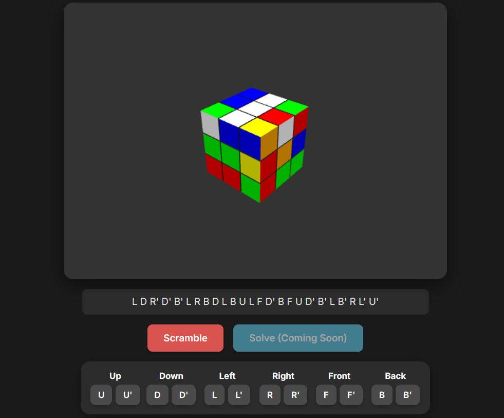

# 3D Rubik's Cube Interactive Visualizer

This project is a frontend application that provides a fully interactive 3D visualization of a Rubik's Cube, built with TypeScript and Three.js. It is designed to connect to a separate backend solver service to fetch solutions for scrambled states and visualize the solving process.



## Features

- **Interactive 3D Cube:** View and manipulate the cube in a 3D space using mouse controls (click and drag to rotate).
- **Manual Moves:** Perform all standard Rubik's Cube moves (U, D, L, R, F, B, and their inverse counterparts) using on-screen buttons.
- **Scramble Functionality:** Instantly apply a random 25-move scramble to the cube.
- **Backend Integration:** Designed to send the cube's state to a backend API and receive a solution sequence.
- **Animated Solving:** Once a solution is received, the cube will automatically animate the moves to return to its solved state.
- **Modern Tooling:** Built with TypeScript, Three.js, and bundled with Webpack for a clean, modular, and maintainable codebase.

## Project Structure


```
/
|-- dist/                  # Bundled output directory (generated)
|   |-- index.html
|   |-- bundle.js
|
|-- src/                   # TypeScript source code
|   |-- api.ts             # Handles communication with the backend solver
|   |-- cube.ts            # Core logic for creating and manipulating the 3D cube
|   |-- main.ts            # Main application entry point
|   |-- ui.ts              # Manages UI elements and event listeners
|
|-- package.json           # Project dependencies and scripts
|-- README.md              # This file
|-- tsconfig.json          # TypeScript compiler configuration
|-- webpack.config.js      # Webpack bundler configuration
```
## Getting Started

### Prerequisites

- [Node.js](https://nodejs.org/) (v16 or later recommended)
- [npm](https://www.npmjs.com/) (comes with Node.js)

### Installation & Setup

1.  **Clone the repository:**
    ```bash
    git clone [https://github.com/yash-jain-1/rubiks_cube_solver.git](https://github.com/yash-jain-1/rubiks_cube_solver.git)
    cd rubiks-cube-visualizer
    ```

2.  **Install dependencies:**
    ```bash
    npm install
    ```

3.  **Connect to your backend:**
    Open `src/api.ts` and update the `API_URL` constant to point to the endpoint of your running Python solver backend.

    ```typescript
    // src/api.ts
    const API_URL = '[http://127.0.0.1:5000/solve](http://127.0.0.1:5000/solve)'; // <-- Change this to your backend URL
    ```

### Development

To run the application in a development environment with live reloading, use the webpack development server:

```bash
npm run start
```

This will open the application in your default web browser at http://localhost:8080. The page will automatically reload whenever you make changes to the source code.
Building for Production

To create a static, optimized build for deployment, run the following command:

```bash
npm run build
```

This will generate the final bundle.js and index.html files in the dist directory. You can then serve these files from any static web host.

How It Works -->

    State Representation: The cube's state is managed visually by Three.js. For communication with the backend, the state of the 54 facelets is read using raycasting to generate a standard "facelet string".

    User Interaction: The ui.ts module captures clicks on the control buttons. Manual moves are sent to the cube.ts module to be animated directly.

    Solving Process:

        When the "Solve" button is clicked, ui.ts calls a function in api.ts.

        api.ts reads the current cube state and sends it as a JSON payload to the backend solver API.

        The backend processes the state and returns a solution as a space-separated string of moves (e.g., "R U R' F2...").

        This solution string is then passed to the cube.ts module, which queues up the moves and animates them sequentially.
